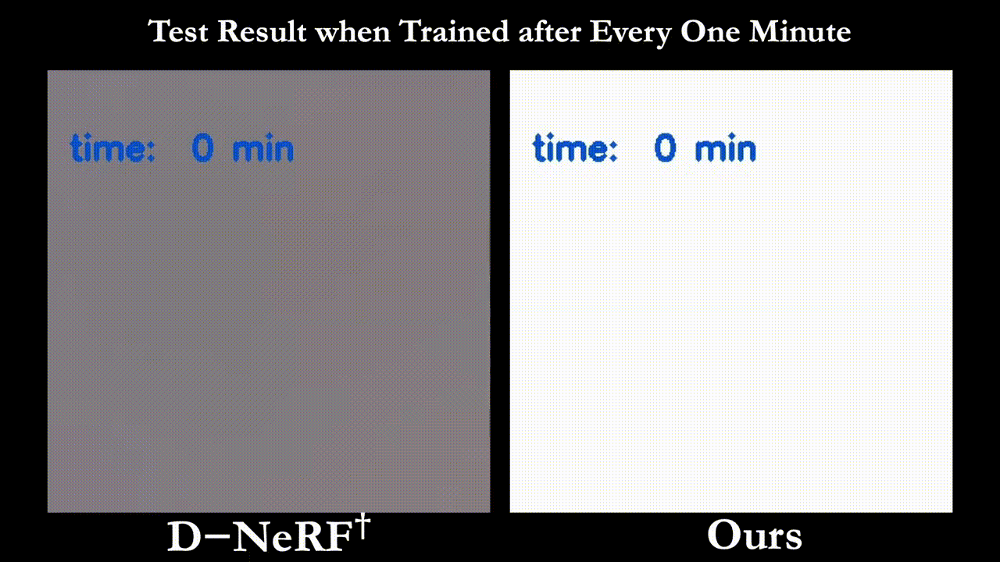
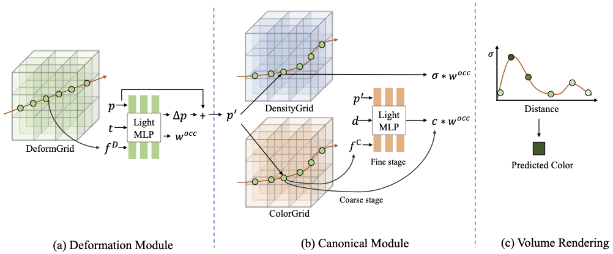

# NDVG: Neural Deformable Voxel Grid

## ACCV 2022 (Oral)

### [Project Page](https://npucvr.github.io/NDVG/) | [Paper](https://arxiv.org/abs/2206.07698) | [Video](https://youtu.be/BVKF3m49kj0) | [LAB Page](http://npu-cvr.cn/)
Neural Deformable Voxel Grid for Fast Optimization of Dynamic View Synthesis   

---------------------------------------------------
Below is the training process of our method (right), compared with D-NeRF (left).   



In this paper, we propose a fast optimization
method, named NDVG for dynamic scene view synthesis based on the voxel-grid
representation. Our method consists of a deformation module and a canonical
module. The deformation module maps a 3D point in the observation space to
canonical space, and volume rendering is performed in the canonical space to
render the pixel color and compute image reconstruction loss. In contrast to
static scene applications where the occlusion is only determined by the viewing
direction when the scene is known, the occlusion in the dynamic scene NeRF
is determined by both view direction and motion (or view time) and should be
taken well care of. Hence, we designed a particular occlusion handling module
to explicitly model the occlusion to further improve the rendering quality.   



### Update
- 2022.11.25: Initial release.

## Installation
```
git clone https://github.com/SeanGuo063/NDVG.git
cd NDVG
pip install -r requirements.txt
```
Pytorch installation is machine dependent, please install the correct version for your machine. The tested version is pytorch 1.11.0 with python 3.8.0 on NVIDIA GeForce RTX 3090.


## Download: datasets, trained models and rendered test views

### Datasets
Directory structure for the datasets (only list used files)

    data
    ├── dnerf_synthetic     # Link: https://www.dropbox.com/s/0bf6fl0ye2vz3vr/data.zip?dl=0
    │   └── [bouncingballs|hellwarrior|hook|jumpingjacks|lego|mutant|standup|trex]
    │
    └── Hypernerf     # Link: https://github.com/google/hypernerf/releases/tag/v0.1
        │             # organize them as https://github.com/google/nerfies#datasets
        └── [vrig-3dprinter|broom2|vrig-chicken|vrig-peel-banana]

### Trained models and rendered test views
Download our trained models, which are used to generate results reported in our paper, from [here](https://drive.google.com/drive/folders/1cJ0_EREKwAUik-3fyKaPMbayXp49jHeh?usp=share_link). Extract the downloaded zip files in corresponding positions, the structure is

    logs
    ├── dnerf       # models for dnerf dataset
    │   └── [ndvg_dnerf_bouncingballs|hellwarrior|hook|jumpingjacks|lego|mutant|standup|trex]
    │
    └── hypernerf   # models for hypernerf dataset
        └── [ndvg_hypernerf_3dprinter|broom|chicken|peel-banana]

## Train and Evaluation

### Train
To train dnerf dataset, like `lego`, and evaluate testset `PSNR` at the end of training, run:
```bash
$ python run_dnerfdata.py --config configs/expspaper/dnerf/lego.py --use_coarse_voxgrid --use_fine_voxgrid --render_test
```

To train hypernerf dataset, like `3dprinter`, and evaluate testset `PSNR` at the end of training, run:
```bash
$ python run_hypernerfdata.py --config configs/expspaper/hypernerf/3dprinter.py --use_fine_voxgrid --render_test
```

### Evaluation
To reproduce the evaluation results of the paper, run:
```bash
$ python run_dnerfdata.py --config configs/expspaper/dnerf/lego.py --use_coarse_voxgrid --use_fine_voxgrid --render_test --render_only --eval_ssim --eval_lpips_vgg
```

```bash
$ python run_hypernerfdata.py --config configs/expspaper/hypernerf/3dprinter.py --use_fine_voxgrid --render_test --render_only
```

## Acknowledgement
This repository is partially based on [DirectVoxGO](https://github.com/sunset1995/DirectVoxGO) and [D-NeRF](https://github.com/albertpumarola/D-NeRF). Thanks for their awesome works.

## Citation
If you find this repository helpful for your research, welcome to give a star and cite our paper.

```
@InProceedings{Guo_2022_NDVG_ACCV,
  title     = {Neural Deformable Voxel Grid for Fast Optimization of Dynamic View Synthesis},
  author    = {Guo, Xiang and Chen, Guanying and Dai, Yuchao and Ye, Xiaoqing and Sun, Jiadai and Tan, Xiao and Ding, Errui},
  booktitle = {Proceedings of the Asian Conference on Computer Vision (ACCV)},
  year      = {2022}
}
```